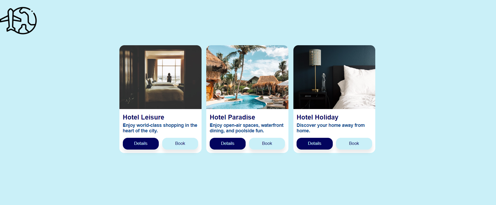

# Challenge Project: CSS-in-JS with @emotion/react library

## General Info

>*In this tutorial, you will style a React app with the Emotion library as an example of using CSS-in-JS. You will be styling a travel app that features three hotel cards. Each card contains a main image, title, description, and buttons prompting the user to view more details about the hotel or book a room.*

----

A project for making a React web application that usess CSS-in-JS library Emotion. 

This project is part of Codecademy front-end course.

## Technologies
- React v17.0.2
- @emotion/react v11.10.5
- @emotion/styled v11.10.5

## Launch

- Deploy the app with Surge

## Info about article author 

- Author: Rob Merrill
- Publish Date: Nov 17, 2021 for [Codecademy](https://codecademy.com)

### Screenshot

